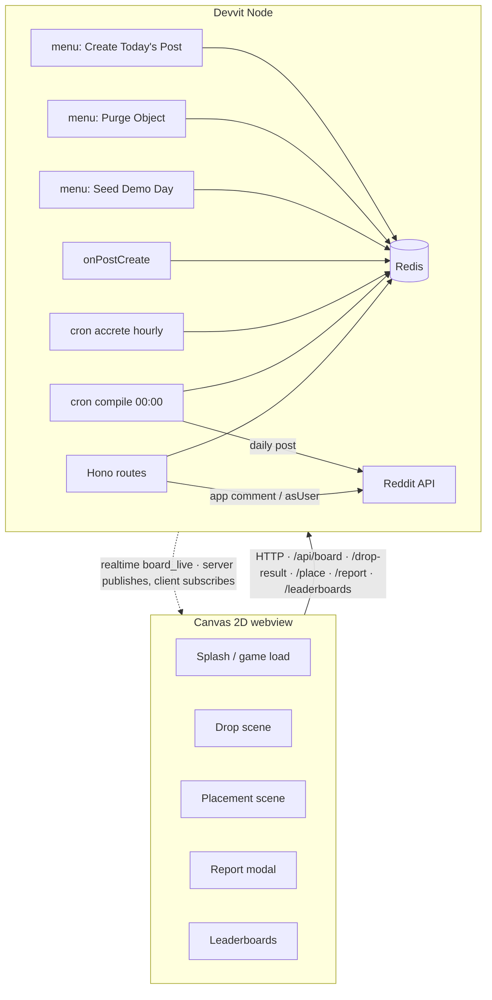

# ARCHITECTURE — Grudgeball

## Stack

| Layer | Choice | Why |
|---|---|---|
| Client | Canvas 2D + deterministic grid drop sim, thin TS overlay | Lightweight, dependency-free renderer (see [Honest limitations](README.md#-honest-limitations) — Phaser is a listed dependency but unused; plausible arcade feel, not rigid-body physics) |
| Server | Devvit serverless Node + Hono | Verified platform pattern; `/api/*` + `/internal/*` routes |
| State | Devvit Redis (hashes + zsets + tx) | Only persistent store on-platform; localStorage is wiped on updates |
| Jobs | Devvit scheduler (cron) | Midnight compile + hourly accretion ARE the game clock |
| Live | Devvit realtime channel | 1Hz batched board events; garnish, not load-bearing |
| Boilerplate | `devvit-template-phaser` (github.com/reddit/devvit-template-phaser) | Official template; no boilerplates.json match for Devvit — closest catalog analog N/A |

No ML models anywhere — deliberate anti-"AI-slop" stance (the organizer's #1 anti-preference); content is procedural + crowd-made.

## System diagram

## Redis schema

| Key | Type | Content |
|---|---|---|
| `board:{day}` | hash | objectId → packed {type, cell, rot, author, name, kills, saves} |
| `queue:{day+1}` | zset | placementId scored by ts (accretion order) |
| `density:{day}:{band}` | hash | per-band trap/angel counts (cap enforcement) |
| `lb:depth:{day}` / `lb:menace:{day}` / `lb:angel:{day}` | zset | score ladders |
| `user:{id}:{day}` | hash | marblesUsed, placed, lastReportSeen |
| `report:{day}:{id}` | hash | kills, saves, rankDelta, boardStats |
| `shadow:{day}` | zset | plausibility-flagged runs (mod review) |
| `streak:{id}` | hash | current, best, lastDay |

All queues are timestamp-scored zsets (platform has no plain lists/sets). Data siloed per subreddit by platform design — embraced: each community grows its own board culture.

## API endpoints

| Route | Method | Purpose |
|---|---|---|
| `/api/board?day=` | GET | board hash + accretion state + cruelty multiplier |
| `/api/drop-result` | POST | stroke events + trajectory polyline → validated score write (tx) |
| `/api/place` | POST | placement transaction (see COMPLEXITY §1) |
| `/api/report` | GET | my Grudge Report for the morning modal |
| `/api/leaderboards?day=` | GET | top-N + my neighborhood (zRange window fallback if zRank unverified) |
| `/internal/cron/compile` | POST | idempotent board(day+1) build + daily post creation |
| `/internal/cron/accrete` | POST | hourly cohort release + multiplier tick |
| `/internal/triggers/post-create` | POST | bind day-state to scheduler-created post |
| `/internal/menu/seed` `/internal/menu/purge` | POST | mod tools |

## Invariants & residual risk

- **I1–I5** in COMPLEXITY.md (placement uniqueness, solvability, density caps, audit, economy symmetry).
- **Residual risks, documented honestly:** client-authoritative physics can be spoofed within plausibility bounds (mitigated to leaderboard-shadowing, never state corruption); daily marble limit is per-Reddit-account (alt accounts possible — same exposure as every Devvit game; noted in README); realtime delivery is best-effort (game fully playable without it).

## API verification — ✅ CLOSED 2026-07-04

All formerly-flagged surfaces verified against `@devvit/*@0.13.6` type definitions: `Comment.distinguish(makeSticky?)` ✓ (stickied report comments ship as designed) · `setUserFlair`/flair templates ✓ · `zRank` ✓ (rival windows as designed) · `realtime.send(channel,msg)` + `connectRealtime` ✓ (rate limits unpublished — keep 1Hz batching as prudent design) · `submitCustomPost` ✓ · payments package ✓. **New design input:** templates split `splash.html` (fast inline feed view) from `game.html` — D1 must ship a legible board-snapshot splash. **Ops landmine:** new test subreddits get auto-banned (incl. re-ban on first app install); create r/GrudgeballGame day one and use the Devpost forum unban thread.
