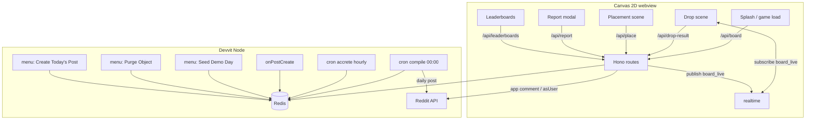

<div align="center">
  
  <h1>Grudgeball</h1>
  <p><em>Die, plant your revenge, count the bodies at dawn — a daily marble gauntlet on Reddit, built by the crowd.</em></p>
  

  <br/><br/>

  [](https://reddit.com/r/GrudgeballGame)
  [](DEMO.md)
  [](https://edycutjong.github.io/grudgeball/pitch)
  [](https://edycutjong.github.io/grudgeball/)
  [](https://redditgameswithahook.devpost.com)

  <br/>

  
  
  
  
  
  
  [](https://github.com/edycutjong/grudgeball/actions/workflows/ci.yml)
</div>

---

**The problem:** Reddit games get played once and abandoned, and daily games run
out of hand-authored content. **The solution:** make the players the content
engine — everyone plays one shared board, and spending your marbles earns you
**one** attributed object placed into *tomorrow's* board. **What's built:** a
green, tested Devvit app (Hono server + Canvas-2D client over a pure shared core)
where every placement passes an in-transaction A\* solvability check, a nightly
scheduler compiles the board, and a personal **Grudge Report** turns yesterday's
crowd into your reason to return.

You get three marbles a day. You drop them through a machine of bumpers, fans,
magnets, and spikes — every object placed and *named* by another redditor, with
their username and body count on it. Plant a spike and earn **Menace** credit for
every stranger it kills overnight; plant a booster or cushion and earn **Angel**
credit for every run it saves. In the morning: *"Your spike 'Greg's Regret' claimed
87 marbles. You are today's #3 Menace."*

The board compiles at midnight UTC and accretes new objects every hour, so a
**Cruelty Multiplier** climbs all day. The traces of other players *are* the
content — the demo post is alive at any hour a judge opens it.

### 🔒 Sealed by architecture

Everything runs on Reddit's own infrastructure — **no external services, no
third-party APIs, no data ever leaves the platform, no runtime AI.** The
`devvit.json` `http` allowlist is **empty**; the client only calls same-origin
`/api/*`; all state lives in Redis. Nothing to configure, no API keys to install,
no privacy-policy friction — **privacy by architecture.** The board is
manufactured entirely by feed traffic and Redis, not by a model.

---

## 📸 The magic moment

> You drop your marble down the center. It threads the friendly top third, then
> dies on **"Greg's Regret"** — a spike a stranger named. A big **`312`** ticks up
> to **`313` bodies claimed**, `u/gb_founder_greg banks +1 Menace`, and you're told
> `You were victim #313`. Then you get to do the same to someone else.

This beat is **verified deterministic** on the seeded board: center drop → row 13 →
`Greg's Regret` → score **3510** (`13 × 100 × cruelty 2.7`). It is witnessable **on
load** — see [Offline demo mode](#-offline-demo-mode) and [`DEMO.md`](DEMO.md).

---

## 🕹️ How to play

1. Open today's Grudgeball post. The inline **splash** card shows a live board
   snapshot and a CTA — tap **ENTER THE GAUNTLET** to expand into the game.
2. **Drop (×3):** tap a column to aim, then press **DROP**. Watch the marble
   carom down. If it dies, a killer card names the object and its author, shows the
   trap's accumulated body count **ticking up to include your marble**, and credits
   that builder. If it survives, you bank depth + coins × the day's Cruelty Multiplier.
3. **Place (×1):** once your three marbles are spent, the board dims and the
   placement palette opens. Pick one of eight objects (Menace red / Angel green
   / Neutral brass), tap a glowing legal cell, name your grudge (≤24 chars,
   word-filtered), and **PLANT**. It returns at dawn in tomorrow's board.
4. **Report:** come back the next day. The morning Grudge Report modal fires
   once, showing what your object did overnight and your rank movement.
5. **Leaderboards:** Depth / Menace / Angel / Streak, with your row pinned.

Scoring is server-authoritative: `score = (depth×100 + coins×25 + goal×500) ×
cruelty`, where `cruelty(t) = 1.0 + 3.0 × (active_traps / trap_cap)`, clamped to
[1.0, 4.0].

---

## 🏗️ Architecture

Devvit Web app: a **Hono server** (`src/server`) + a **Canvas 2D client**
(`src/client`) over a pure, platform-free **shared core** (`src/shared`).
Full schema + endpoint tables in [`ARCHITECTURE.md`](ARCHITECTURE.md).



```
src/
  shared/    pure domain logic — imported by client, server, and tests alike
    constants · types · grid · terrain · solvability (A*) · cruelty · score
    day (UTC math) · plausibility · names (word filter) · rng · protocol · fixtures/
  server/    Hono adapters over the pure core (Redis + Reddit + scheduler)
    routes/  api (board/drop-result/place/report/leaderboards) · cron · menu · forms · triggers
    core/    placement (watch/multi/exec) · compile · dropResult · boardRead · report
             leaderboards · seed · purge · post · keys (the whole Redis schema)
  client/    splash.html (inline feed) + game.html (expanded) + Canvas renderer + drop sim
             lib/  api (typed fetch, demo fallback) · sim (drop) · board-render · demo (offline)
```

**Data model — Redis hashes and sorted-sets only** (no plain lists/sets):

- `board:{day}` **hash** — packed objects + `obj:{id}:kills|saves` counters + meta.
- `queue:{day}` **zset** (by timestamp) + `queued:{day}` **hash** — tomorrow's material.
- `density:{day}:{band}` **hash** — per-band category counts for the cap check (I3).
- `lb:{depth|menace|angel}:{day}` + `lb:streak` **zsets** — score ladders.
- `user:{id}:{day}`, `report:{day}:{id}`, `streak:{id}`, `shadow:{day}`, `postmap`, `daypost`.

**The crown jewel** is the placement transaction: one `watch/multi/exec` guards
every placement, enforcing *in-transaction* — one placement per user per day
(I1), cell vacancy, per-band density caps (I3), and an **A\* solvability check**
(I2: the player-built board can never become an impassable spike wall). The
compiler re-validates all of it as defense-in-depth and lays deterministic
terrain from `seed = hash(day)`, so `compile(day)` is idempotent and
byte-reproducible.

**Devvit surface exercised:** `redis.watch/multi/exec`, hashes + zsets,
scheduler cron ×2 (`compile` 00:00, `accrete` hourly), `onPostCreate` trigger,
menu actions ×3 (seed, purge, manual post), realtime channel `board_live`
(1 Hz-batched, best-effort), Reddit API app comment + consent-gated
`asUser SUBMIT_COMMENT`. **Fetch allowlist: empty** (`devvit.json` `http.enable:
false`). See `SPONSOR_DEFENSE.md` for the "why only Reddit/Devvit" table.

---

## ✅ Tests

**235 tests across 23 files, all passing** (`npm test` → `vitest run`), with
**100% statement/branch/function/line coverage** on `src/shared/**` +
`src/server/core/**` + `src/server/routes/**` (`npm run test:coverage`).
`src/client/**` (Canvas/Phaser, needs a real browser) and `src/server/index.ts`
(process bootstrap) are intentionally excluded from that gate — same "client
is playable core, not full UI" caveat as [Honest limitations](#-honest-limitations).

| File | Cases | Covers |
|------|------:|--------|
| `tests/routes/api.test.ts` | 26 | `/api/{board,drop-result,place,report,leaderboards}` end-to-end via a mocked `@devvit/web/server` |
| `tests/placement.test.ts` | 21 | one-per-day (I1), density caps (I3), solvability refusal (I2), contested-cell tx |
| `tests/plausibility.test.ts` | 19 | anti-cheat gates: speed, coin ceiling, velocity continuity, event integrity |
| `tests/boardRead.test.ts` | 17 | board parsing, live/preview `boardView`, player day-state |
| `tests/compile.test.ts` | 16 | determinism, idempotency, band-cap defense, **1/24 accretion cohorts** |
| `tests/redisStub.test.ts` | 13 | the in-memory `watch/multi/exec` + zset/hash stub the suite runs on |
| `tests/pack.test.ts` | 13 | byte-deterministic (un)packing + every malformed-payload branch |
| `tests/dropResult.test.ts` | 13 | anti-cheat ledger: marble spend, shadow-flagging, kill/save credit, streaks |
| `tests/solvability.test.ts` | 10 | A\* gravity pathfinding on blocked grids |
| `tests/report.test.ts` | 10 | Grudge Report aggregation + headline generation |
| `tests/purge.test.ts` | 9 | mod purge from board or queue, by id or name |
| `tests/routes/triggers.test.ts` | 8 | `onPostCreate` day-binding, idempotent |
| `tests/names.test.ts` | 8 | word filter + length clamp |
| `tests/routes/menu.test.ts` | 7 | Seed Demo Day / Purge form / manual post-create menu actions |
| `tests/routes/cron.test.ts` | 7 | `/internal/cron/{compile,accrete}` scheduler endpoints |
| `tests/routes/forms.test.ts` | 6 | purge-confirmation form submission |
| `tests/leaderboards.test.ts` | 6 | top-10 + pinned-neighbor windows across all 4 tabs |
| `tests/cruelty.test.ts` | 6 | cruelty curve `1.0 + 3.0×(traps/cap)`, clamped |
| `tests/grid.test.ts` | 5 | cells, bands, placement zones, legality |
| `tests/day.test.ts` | 5 | UTC day/hour math, day-number, round-trip validation |
| `tests/seed.test.ts` | 4 | demo-day seeding, deterministic + idempotent |
| `tests/score.test.ts` | 4 | scoring formula + cruelty multiplier rounding |
| `tests/post.test.ts` | 2 | daily post title + Reddit submission adapter |

Run one file: `npx vitest run tests/compile.test.ts`.

Type-check everything (client + server + shared + tests):
`npm run type-check` (`tsc --build && tsc -p tsconfig.test.json`).

---

## 🧪 Testing & CI

The submission repo root is this `build/` folder. CI runs the **real gates** — no
Next.js scripts, no invented tooling.

```bash
npm ci                    # clean install from package-lock
npm run lint              # eslint
npm run type-check        # tsc --build (client+server+shared) + test project
npm test                  # vitest run — 235 tests
npm run test:coverage     # vitest run --coverage — 100% on shared/core/routes
npm run build             # vite build → dist/client/{splash,game}.html + dist/server
npm run check:submission  # pre-submission gate (URLs, README sections, placeholders)
```

| Layer | Tool | Status |
|---|---|---|
| Code Quality | TypeScript 6, strict, `tsc --build` | ✅ |
| Lint | ESLint 9 + typescript-eslint | ✅ |
| Unit Testing | Vitest — **235 tests / 23 files** | ✅ |
| Coverage | 100% stmts/branch/func/line on shared+core+routes | ✅ |
| Build Verification | Vite (client + server → `dist/`) | ✅ |
| CI/CD Pipeline | GitHub Actions, Node **20 + 22**, concurrency-guarded | ✅ |
| Security (SAST) | CodeQL (`javascript-typescript`) | ✅ |
| Security (SCA) | Dependabot (npm + github-actions, weekly) | ✅ |
| E2E vs localhost | **N/A — Devvit adaptation** (see below) | — |
| Performance (Lighthouse) | **N/A — Devvit adaptation** (see below) | — |

**Devvit adaptations (deliberately omitted, documented):** a Devvit app runs
inside Reddit's **webview** — there is no served `localhost:3000` origin. So
**Playwright-against-localhost** and **Lighthouse CI** (both of which need a live
HTTP server URL) do not apply here; the client is static HTML built to
`dist/client/`, and the real end-to-end path is `devvit playtest` on a test
subreddit (which needs a Reddit login — see the checklist below). The magic-moment
loop is instead verified deterministically by the shared-core unit tests and the
offline demo mode.

---

## 🎬 Offline demo mode

The full loop is **witnessable on load with the seeded board even with no server**.
Each `/api/*` call (`src/client/lib/api.ts`) tries the real Hono server first and
only falls back to `src/client/lib/demo.ts` when the fetch or JSON parse genuinely
fails — i.e. there is no Devvit host answering (the built client opened directly, a
static preview, or a screen recording). The fallback:

- Renders the deterministic **60-object founder board** (`src/shared/fixtures/demoBoard.ts`).
- Runs the **same** shared `simulateDrop` / `scoreRun` / `cruelty` the server uses —
  it invents no game logic, so a center drop still dies on Greg's Regret for 3510.
- Shows an honest `· demo` marker in the HUD/splash so it is never mistaken for the
  live server. In the real Reddit webview the server answers first, so this code is
  **inert** — a live `{status:"error"}` response is honored, never masked.

---

## 🌱 Seeding the demo board

Two equivalent paths produce the same deterministic 60-object founder board so a
judge gets the identical experience every run. **Seed data is labeled as such**
(authors are 12 clearly-named `u/gb_founder_*` accounts — no fake-user smell).

- **In-app (writes to Redis):** moderator menu → **"Grudgeball: Seed Demo Day"**.
  Loads the 60-object board, populated kill/save counters, 40 synthetic ghost
  trails, yesterday's leaderboards, and — for the invoking mod — a pre-populated
  Grudge Report so the morning modal demos immediately. Idempotent: re-seeding
  the same day yields a byte-identical `board:{day}` hash.
- **Offline (writes a repo fixture):** `npm run seed:local`. Materializes the
  same fixture to `data/fixtures/demo-board.json` for inspection/diffing and
  asserts the fixture is byte-deterministic.

The seeded board is a funnel: the centre-column drop line ends at **"Greg's
Regret"** (a spike with 312 kills). See `DEMO.md` for the judge path.

---

## 🛡️ Anti-cheat & trust model (honest tier)

Grudgeball states its trust model plainly, because pretending otherwise would be
the dishonest thing.

- **Client physics is authoritative for *feel*; the server is authoritative for
  *records*.** The client simulates the drop and reports a decimated trajectory
  polyline (≤64 points), depth, coins, and collision events.
- The server re-scores server-side and runs **plausibility gates** (min elapsed
  time per depth, coin ceiling per fountain, velocity continuity / no teleports
  or anti-gravity, event↔object type integrity, depth↔polyline reconciliation).
- **Failures never hard-reject.** A failing run still consumes the marble, gets a
  normal-looking ack, and lands in a `shadow:{day}` zset — leaderboard-hidden and
  mod-reviewable — rather than being rejected. Records are plausibility-checked
  and shadow-flagged, **not cryptographically proven**.
- The per-day marble counter lives *inside* the same `watch/multi/exec` as the
  score write, so the 3/day limit cannot be raced.

**Known limitations:**
1. A sophisticated cheater can shave leaderboard scores (shadow-flagged, not prevented).
2. Realtime is best-effort garnish; players see landings, not each other's marbles mid-flight.
3. Daily limits are per Reddit account; alts are a platform-level exposure shared by all Devvit games.

Moderation is a one-paragraph plan by design: a fixed 8-object palette (no free
drawing), a name word-filter, report-to-hide, and a mod **Purge Object** menu
action.

---

## 💻 Local development

```bash
npm install
npm run lint              # eslint
npm run type-check        # tsc --build (client+server+shared) + test project
npm test                  # vitest run — 235 tests
npm run test:coverage     # vitest run --coverage — 100% on shared/core/routes
npm run build             # vite build → dist/client/{splash,game}.html + dist/server
npm run seed:local        # regenerate data/fixtures/demo-board.json (deterministic)
npm run check:submission  # pre-submission gate (see below)
```

You cannot run the actual game loop against Reddit without auth — that is the
playtest step below. `npm run build` verifies the client compiles and both
entrypoints resolve; it does **not** exercise Redis/Reddit (those exist only at
runtime). To witness the loop with zero auth, open the built client — the
[offline demo mode](#-offline-demo-mode) takes over.

---

## 📋 First playtest checklist

You (the human) run these — they need a Reddit login this environment does not
have.

1. **Front-load the subreddit-ban round-trip (do this first).**
   New hackathon subreddits are currently being **auto-banned ("Rule #2") by
   Reddit safety automation — including a re-ban immediately after you install a
   Devvit app.** Reddit staff unban manually when you post your username +
   subreddit in the Devpost forum thread. Mitigation:
   - Create your test subreddit (e.g. **r/GrudgeballGame**) from your aged main
     account on **day one**, and add a normal pinned post before installing anything.
   - **Expect a re-ban at first app install.** Keep the unban-thread link handy
     and install `dr-admin-approve` per the Devvit rules.
   - Do this early so the ban/unban latency doesn't block your demo.
2. **Log in:** `npm run login` (`devvit login`) with the account that owns the
   test subreddit.
3. **Playtest:** `npm run dev` (`devvit playtest`) — it builds and uploads to your
   dev subreddit (`devvit.json` → `dev.subreddit: "GrudgeballGame"`) and hot-reloads.
4. **Open the post and verify the two entrypoints:**
   - The **splash** (`default`, inline) renders the board snapshot + CTA in the feed.
   - Tapping the CTA calls `requestExpandedMode(event, 'game')` and the **game**
     (`game.html`, tall) opens. Confirm the HUD (`DAY N · TRAPS · CRUELTY ×`),
     marble pips, aim/drop, killer card (with the body-count tick), placement
     palette, and (after a compile) the report modal all appear.
5. **Seed for a live demo:** run the **"Grudgeball: Seed Demo Day"** mod menu
   action, then open today's post and drop down the centre column → death to
   Greg's Regret. Follow `DEMO.md` end to end.
6. On a fresh board with no compile yet, `/api/drop-result` returns `closed` —
   that's expected; seed (step 5) or wait for the midnight cron.

---

## 📮 Submission checklist

Run `npm run check:submission` before submitting. It fails until these are done.
Fill the two URLs **after** `devvit publish` and creating the demo post:

- App listing: <APP_LISTING_URL>
- Demo post: <DEMO_POST_URL>
- [x] `npm run lint` clean
- [x] `npm run type-check` clean
- [x] `npm test` green (235/235), `npm run test:coverage` at 100%
- [x] `npm run build` succeeds (both entrypoints resolve)
- [ ] Demo post seeded (`Seed Demo Day`) and verified against `DEMO.md`
- [ ] Public repo URL added to the Devpost form
- [ ] 60-second video recorded (beat script in `DEMO.md`)

## ⚙️ Engineering harness

| File | Purpose |
|---|---|
| `.github/workflows/ci.yml` | Node 22: `npm ci` → `lint` → `type-check` → `test:coverage` (100%) → `build` |
| `.github/workflows/pages.yml` | Deploys `docs/` (landing + pitch deck) to GitHub Pages |
| `.github/workflows/codeql.yml` | CodeQL SAST (`javascript-typescript`) |
| `.github/dependabot.yml` | Weekly npm + github-actions dependency PRs |
| `LICENSE` | MIT © 2026 Edy Cu |
| `.github/CODE_OF_CONDUCT.md`, `CONTRIBUTING.md`, `SECURITY.md` | Community health + private vuln-reporting policy |
| `.github/ISSUE_TEMPLATE/*`, `PULL_REQUEST_TEMPLATE.md` | Bug/feature templates, PR checklist |

## ⚠️ Honest limitations

The shipped renderer is **Canvas 2D**, not Phaser (Phaser is a listed
dependency but the MVP uses a lightweight, dependency-free canvas renderer and a
deterministic grid drop simulation — see `docs/friction-log.md`). The physics is
plausible arcade feel, not a rigid-body simulation; the server treats it as
untrusted regardless.

## 🔖 Versioning

Automatic semantic versioning via [semantic-release](https://semantic-release.gitbook.io/):
every push to `main` parses [Conventional Commits](https://www.conventionalcommits.org/)
(`fix:` → patch, `feat:` → minor, `BREAKING CHANGE:` → major) and, when warranted,
bumps `package.json`, updates `CHANGELOG.md`, tags the commit, and publishes a
GitHub Release with generated notes (`.github/workflows/release.yml`). No manual
version bumps, no npm registry publish (private app).

## 📄 License

[MIT](LICENSE) © 2026 Edy Cu. Built for Reddit's *Games with a Hook*. Native
Devvit — thank you to the Devvit team for the Redis, scheduler, realtime, and
Reddit APIs that make a crowd-built board possible.
